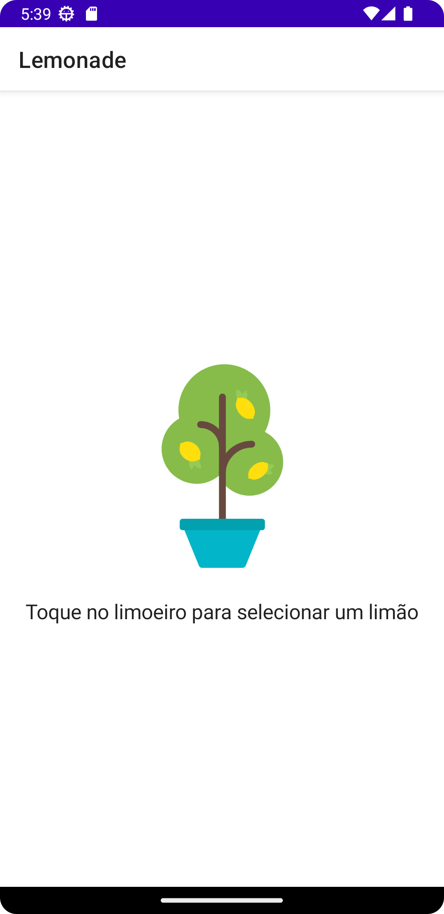

<h1 align="center">Lemonade</h1>

   
  

  

⭐ Projeto utilizado para o estudo da mudança de esteado de componentes do Compose. 

## Tela

## Tecnologias usadas e bibliotecas de código aberto

- Tutorial do Jetpack Compose [https://developer.android.com/jetpack/compose/tutorial?authuser=2&hl=pt-br]
- Estado e Jetpack Compose [https://developer.android.com/jetpack/compose/state?authuser=2&hl=pt-br]
 

